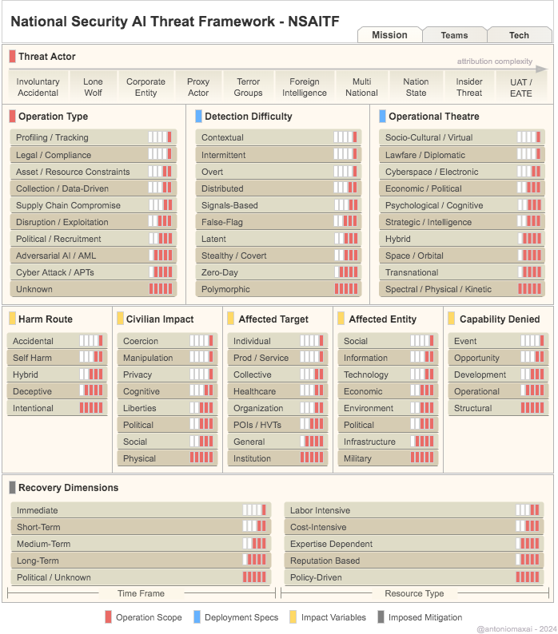

# National Security AI Threat Framework Taxonomy - (NSAITF)

You can read the full article featuring the NSAITF in its final chapter on my Substack:  [Algorithmic Frontiers | The IC AI Multiplier: Automating Superiority](https://antoniomax.substack.com/p/the-ic-ai-multiplier-automating-superiority)

A high resolution version of the NSAITF diagram is available here: [NSAITF 300dpi](NSAITF-300.png)

>**Update July 6, 2024**:
>The NSAITF was evaluated using 23 out of 29 Cyber Law collection scenarios from NATO's Cooperative Cyber Defence Centre of Excellence (CCDCOE). This approach enabled both qualitative assessment and quantitative analysis of the societal impacts of cyberwarfare operations. The results of this evaluation are available in a public spreadsheet at: [[Google Sheets document]](https://docs.google.com/spreadsheets/d/1FeekXROr04drN8gcQYSVbv28M3wKvIqJlTgzGLz0bmQ/edit?usp=sharing) 

In today's rapidly evolving technological landscape, the vast majority of the workforce doesn't "speak AI," nor is versed on critical aspects of modern intelligence or other contemporary adversarial operations. From analysts to strategy architects, researchers and  policymakers, bridging these worlds is also a costly and complex endeavor. In their own way, the intelligence community (IC) also is required to see technologies in dual-use capacities, facing the unique challenge of maintaining in-house narratives for both defensive and offensive capabilities, often executed with defensive intent, but offensive nonetheless. It is in this context that the **National Security AI Threat Framework** (NSAITF) bridges these worlds together for comprehensive analysis.

Designed to meet both digital (or cyber) and non-digital activities and operations, and recognizing the increasingly prevalent use of AI in automating several aspects of such operations, the NSAITF provides a high-level model both offensive and defensive AAI/AML (Adversarial Artificial Intelligence/Adversarial Machine Learning) scenarios.  It synthesizes **technical, strategic, operational, and ethical considerations** into a cohesive model, enabling a multidimensional assessment that extends beyond technical specifics. This framework provides a structured perspective on AI-enabled operations, **emphasizing human-centric analysis and illuminating the interdisciplinary impacts on the social fabric**.

By transcending siloed analysis, the NSAITF empowers users to navigate the complexities of AI-enabled operations across various domains, including cyber, political, economic, and cognitive spaces. Its strength lies in qualifying the strategic breadth and operational weight of these operations, offering perspectives to both IC members and other stakeholders. The NSAITF integrates PMESII (Political, Military, Economic, Social, Information, Infrastructure) and other frameworks concepts into one, combining capabilities of threat intelligence frameworks, impact assessment models, risk evaluation tools, consequence analysis frameworks, and recovery planning models into **a hybrid assessment framework**. This framework is highly capable of assessing both objectives and outcomes, allowing for forward planning or the reverse engineering of operations, greatly enhancing its utility in the real world.

The NSAITF also comes with a basic Likert scale scoring mechanism for immediate quantitative analysis. Its neutral attribution selection focuses on activities without political bias, addressing the evolving risks posed by a myriad of threat scenarios. This attribution neutrality ensures that the framework's analysis remains unbiased, even when considering novel complex emergent adversarial AI behaviors and uncontrolled autonomous entities.

>Basic usage 
>Out of the box, it can be as simple as:   Or you may assign weighted averages for categories in personalized use cases: 

Using this system, scores above certain thresholds illustrate potential horizontal escalatory spirals, and the framework helps users understand acceptable operational thresholds from diverse risk perspectives. The taxonomy of the NSAITF groups and categories includes:

- **Operation Scope (Red)**: Covers motivational intents and threat actors, allowing for varied analytical interpretations.
- **Deployment Specs (Blue)**: Specifies digital and non-digital AI deployment approaches across multiple operational environments.
- **Impact Variables (Yellow)**: Adopts a human-centered perspective on effects, covering harm intentions, civilian impacts, and capabilities denied.
- **Imposed Mitigation (Gray)**: Measures recovery impact in time and resources, considering political and socio-economic dimensions.

A key feature of the NSAITF is its emphasis on the human perspective behind adversarial operations. It aims to empower a more informed society, where students, journalists, researchers, and the IC can understand and address the societal effects of these activities, including those domestic in nature, and their side effects, both short and long term. The framework calls for a realistic and foundational approach towards fairness and proportionality in these operations, fostering a informed society.

## NSAITF Taxonomy

Descriptions for the National Security AI Threat Framework categories and subcategories are available below. Categories are grouped using the following suggestion: Operation Scope, Deployment Specs, Impact Variables, and Imposed Mitigation. As the very categories and subcategories of the NSAITF, groups are not static and may be adapted and extended for custom use cases as its users see fit.

As it is, the NSAITF Likert scoring scale ranges from 1 to 5, with no cumulative points. Which means that for each main scored category, in the case of multiple selections, the highest weight should be used for scoring. For the case of weighted average scoring, categories should reflect implementation realities, but the suggested default scoring may still be useful.

The NSAITF intentionally omits explicit ethics and morals dimensions, as it assumes that all operations to be inherently unethical and immoral, with variations only in their severity and impact.

Notably, the NSAITF attempts to measure both objectives and outcomes. Objectives represent the intentional rationale behind operations, while outcomes encompass the results, which may or may not align with the original objectives. Outcomes can be favorable or unfavorable and often include side effects in addition to the intended objectives. This distinction is crucial for analysts and researchers, as using the NSAITF to measure one does not necessarily cover the other. Double assessments including these two dimensions of operations may offer insights that better consolidate a realistic perspective on the relationship between outcomes and intentions.

Finally, given the complexity and politically charged nature of attributing intelligence activities, the NSAITF aims to facilitate the reverse engineering of campaigns and operations by providing a structured instrument for analysis that can be used for such ends. Future iterations and revisions of the NSAITF should strive to further enhance this capability.

## A - Operation Scope - Table 1 - Threat Actor
The Threat Actor category does not require scoring. The available options should cover most scenarios for attributing threats of offensive operations.

<noscript></noscript>

## A - Operation Scope - Table 2 - Operation Type
Operation Type subcategories have a 1 to 5 score. Highest score applies.

<noscript></noscript>

## B - Deployment Specs - Table 3 - Detection Difficulty
Detection Difficulty subcategories have a 1 to 5 score. Highest score applies.

<noscript></noscript>

## B - Deployment Specs - Table 4 - Operational Theatre
Operational Theatre subcategories have a 1 to 5 score. Highest score applies.

<noscript></noscript>

## C - Impact Variables - Table 5 - Harm Route
Harm Route subcategories have a 1 to 5 score. Highest score applies.

<noscript></noscript>

## C - Impact Variables - Table 6 - Civilian Impact
Civilian Impact subcategories have a 1 to 5 score. Highest score applies.

<noscript></noscript>

## C - Impact Variables - Table 7 - Affected Target
Affected Target subcategories have a 1 to 5 score. Highest score applies.

<noscript></noscript>

## C - Impact Variables - Table 8 - Affected Entity
Affected Entity subcategories have a 1 to 5 score. Highest score applies.

<noscript></noscript>

## C - Impact Variables - Table 9 - Capability Denied
Capability Denied subcategories have a 1 to 5 score. Highest score applies.

<noscript></noscript>

## D - Imposed Mitigation - Table 10 - Time Frame
Time Frame subcategories have a 1 to 5 score. Highest score applies.

<noscript></noscript>

## D - Imposed Mitigation - Table 11 - Resource Type
Resource Type subcategories have a 1 to 5 score. Highest score applies.

<noscript></noscript>

